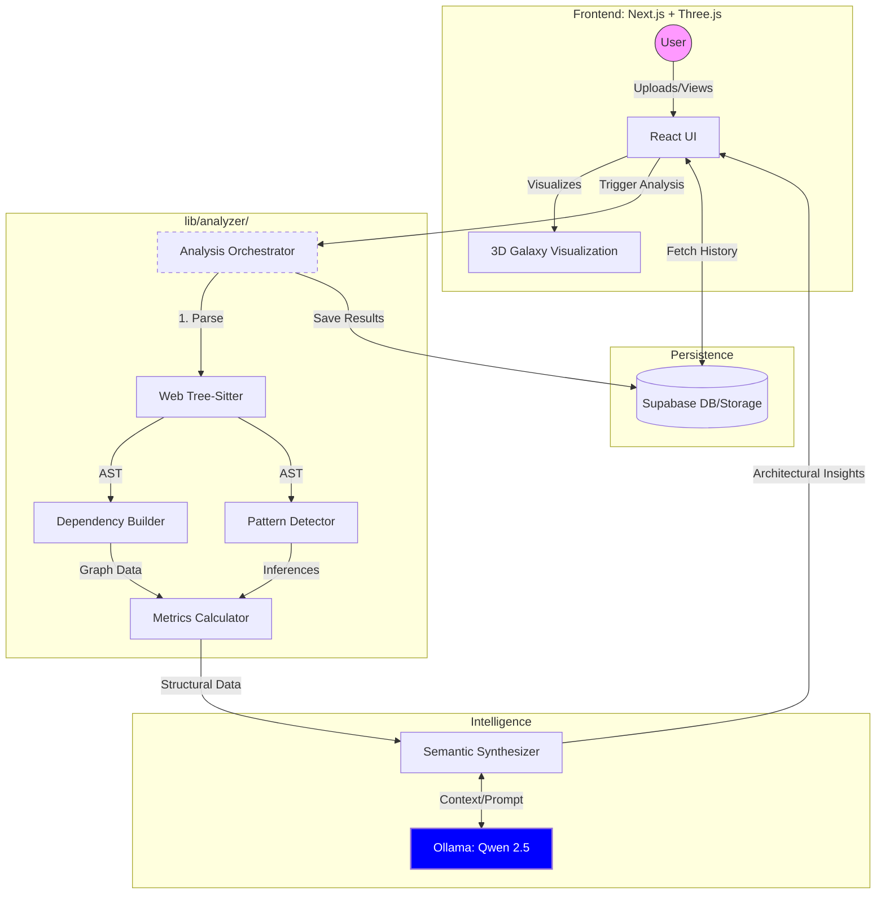

# Architecture Overview: Semantic Intel

Semantic Intel is designed as a modular, AI-augmented code analysis platform. It transforms raw source code into a structured, navigable, and insightful architectural map.

## High-Level System Design

The system follows a modern web architecture with a clear separation between the analysis engine, the visualization layer, and the data persistence layer.

## The Analysis Pipeline

The core logic resides in `lib/analyzer/AnalysisOrchestrator.ts`. The pipeline executes the following steps:

1.  **Parsing**: Uses `web-tree-sitter` for high-performance, statistically accurate AST parsing.
2.  **Pattern Detection**: Employs weighted regex heuristics to identify common design patterns (e.g., Singleton, Factory, MVC).
3.  **Dependency Analysis**: Constructs a directed graph of module relationships based on imports and exports.
4.  **Cross-Cutting Concerns**: Identifies logic that spans multiple modules, such as logging, auth, or error handling.
5.  **Metrics Calculation**: Computes structural metrics including Cyclomatic Complexity, Maintainability Index, and Documentation Density.
6.  **Semantic Synthesis (AI)**: Leverages **Ollama (Qwen 2.5)** to interpret structural data and provide natural language insights and role definitions for files.

## Core Modules (`lib/analyzer/`)

- **[AnalysisOrchestrator.ts](file:///c:/Dev/ab/SEMANTIC-TEST/lib/analyzer/AnalysisOrchestrator.ts)**: The central controller for the analysis flow.
- **[DependencyBuilder.ts](file:///c:/Dev/ab/SEMANTIC-TEST/lib/analyzer/DependencyBuilder.ts)**: Responsible for building the `DependencyGraph`.
- **[PatternDetector.ts](file:///c:/Dev/ab/SEMANTIC-TEST/lib/analyzer/PatternDetector.ts)**: Houses the logic for structural pattern recognition.
- **[SemanticSynthesizer.ts](file:///c:/Dev/ab/SEMANTIC-TEST/lib/analyzer/SemanticSynthesizer.ts)**: The bridge between structural data and Ollama AI.
- **[MetricsCalculator.ts](file:///c:/Dev/ab/SEMANTIC-TEST/lib/analyzer/MetricsCalculator.ts)**: Implements formulas for code health scores.

## Reasoning Model

The system operates on a 3-tier reasoning model:

1.  **Observation**: Raw structural facts (e.g., "File A imports File B").
2.  **Inference**: Pattern identification (e.g., "File A is a Controller").
3.  **Synthesis**: Architectural insights (e.g., "The system follows a Layered Architecture").

## Technology Stack

- **Frontend**: Next.js 14, React, Tailwind CSS.
- **Visualizations**: Three.js, React Three Fiber, Framer Motion (3D Galaxy).
- **AI**: Ollama (Qwen 2.5) running locally.
- **Backend/Auth**: Supabase.
- **Parsing**: Web-Tree-Sitter.
